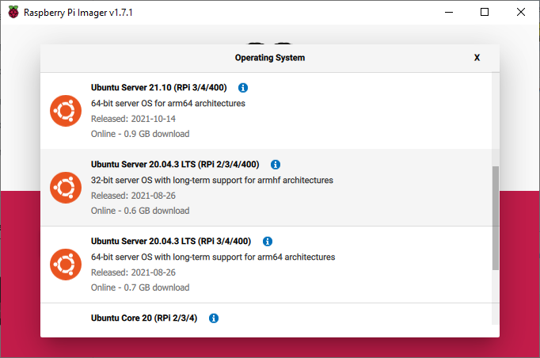
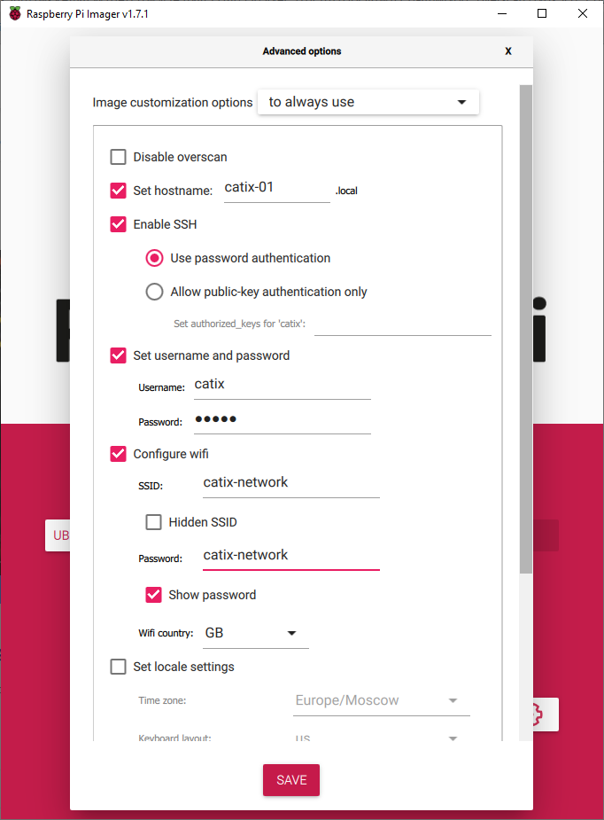

## Install 'Ubuntu Server'

_Note! It is supposed to follow this instruction, 'Raspberry Pi' is equipped with Wi-Fi interface ([Raspberry Pi 3B or better](https://en.wikipedia.org/wiki/Raspberry_Pi#Model_comparison))_    

_It is convenient to set up separate Wi-Fi network first. Then, in any place where such a network will be deployed, robots are always guaranteed to share the same environment without additional settings_

1. Insert SD card (at least 16Gb is recommended)
2. Install [Raspberry Pi Imager](https://www.raspberrypi.com/software/)
3. Open the installed application and select 'Ubuntu Server 20.04.3' to be installed    

4. Open 'Advanced options' and customize options    

    - There is 'catix-01' hostname, where '01' is the serial number of your robot
    - Configure the Wi-Fi network credentials to which the robot to connect to
5. Write the image

---

## Setup host
1. Install the latest version of [VS Code](https://code.visualstudio.com/)
2. Add [Remote Development](https://marketplace.visualstudio.com/items?itemName=ms-vscode-remote.vscode-remote-extensionpack) extension set
3. Add [Docker](https://marketplace.visualstudio.com/items?itemName=ms-azuretools.vscode-docker) extension
4. Set the value of `DOCKER_HOST` variable in 'Docker' extension settings: `tcp://<docker-host>: 2375`, where '\<docker-host\>' is your 'Raspberry Pi' with a docker daemon running.
    
    _After this step, you can connect to the 'Raspberry Pi' via SSH using [Remote-SSH](https://code.visualstudio.com/docs/remote/ssh) extension to follow the next steps_

---

## Setup 'Raspberry Pi'

1. Clone this repository and run the setup script
    ```
    $ git clone https://github.com/CatixBot/Setup.git CatixSetup && cd CatixSetup
    $ chmod +x ./setup.sh && sudo ./setup.sh
    ```
2. Check whether docker has been set up correctly
    ```
    $ docker run hello-world
    ```
3. Restart for the settings to take effect
    ```
    $ sudo reboot
    ```
4. Check that the docker daemon is running. It is required for the next steps.
    ```
    $ systemctl status docker
    ```
5. If the daemon has 'failed' status, it is possible to print its launching logs to figure out the reason
    ```
    $ journalctl -fu docker
    ```
6. Go to the 'Docker' tab in VS Code, which contains a list of robot's ROS2 nodes (docker images and containers).